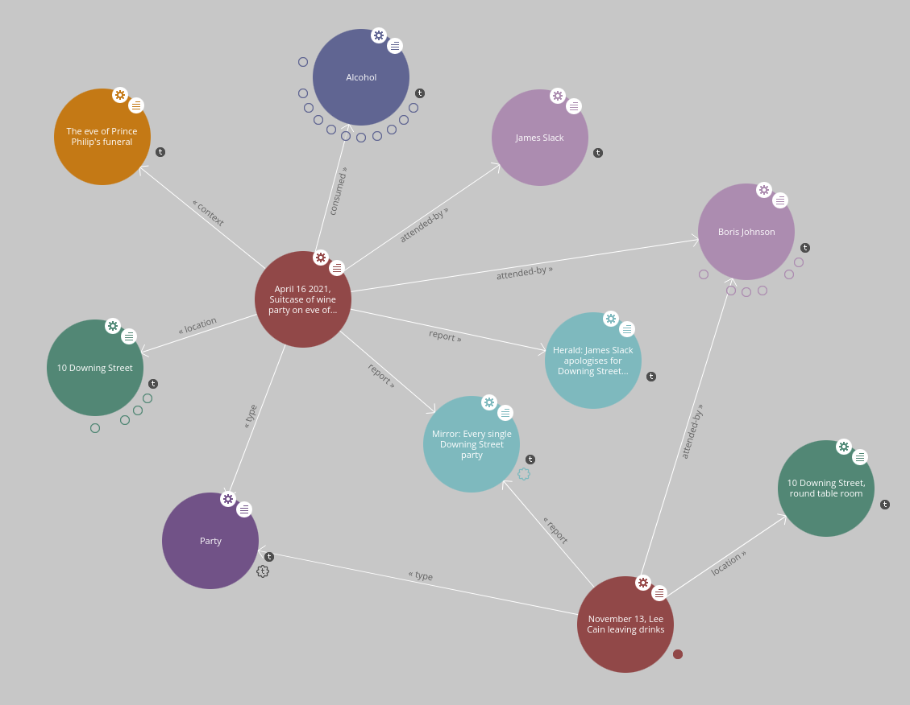

# PartyGateRDF - PartyGate tools for linked-data scientists

If you love this project, you can buy ownership on [OpenSea](https://opensea.io/assets/0x495f947276749ce646f68ac8c248420045cb7b5e/61161627946114775080556842176300922331287397617562685036131001630759023804417)

## Introduction

This is a data set containing references to information published by the media
regarding the Partygate parties held by the government of the UK.

The information has all been gleaned from published information from the media,
and no claims are made about the accuracy of the information in this dataset.
The dataset contains links to some published reports for sourcing.

## Demo

There is a demo which allows easy navigation of the data at
https://web-prod-wrennwfy6q-ew.a.run.app.  This is powered by the
[LodLive](http://lodlive.it) SPARQL navigator, and a SPARQL endpoint serving
the data.



The front page doesn't make it easy to find data items, here are some
interesting entry points:

- [May 15 2020, Wine and Cheese party](https://web-wrennwfy6q-ew.a.run.app/?http://e623fd-partygate/may-15-wine-cheese)
- [Suitcase of wine party](https://web-wrennwfy6q-ew.a.run.app/?http://e623fd-partygate/suitcase-of-wine)
- [Dec 18 2020, 10 Downing Street](https://web-wrennwfy6q-ew.a.run.app/?http://e623fd-partygate/dec-18-no10-party)
- [Dec 14 2020, CCHQ](https://web-wrennwfy6q-ew.a.run.app/?http://e623fd-partygate/dec-14-cchq)
- [Alcohol](https://web-wrennwfy6q-ew.a.run.app/?http://e623fd-partygate/alcohol) -
  this is a representation of the consumption of alcohol.
- [Party](https://web-wrennwfy6q-ew.a.run.app/?http://e623fd-partygate/party) -
  This information node represents the concept of the party 'type'.
- [Number 10](https://web-wrennwfy6q-ew.a.run.app/?http://e623fd-partygate/no-10) -
  this node represents the location of 10 Downing Street.
- [London tier 2 lockdown](https://web-wrennwfy6q-ew.a.run.app/?http://e623fd-partygate/london-tier-2-lockdown) - this node represents the context of the London lockdown in late 2022.

## SPARQL endpoint

There is a SPARQL endpoint at https://web-wrennwfy6q-ew.a.run.app/sparql,
which accepts SPARQL 1.0 queries against the data.  Think of this as way
to run a query against the underlying data.  There is no visualisation,
the SPARQL endpoint is there to allow other applications to access the data.
This endpoint can be queried from Python using
[sparqlwrapper](https://github.com/RDFLib/sparqlwrapper), for instance.

Here are some example queries:

### Information known about the Suitcase of Wine party

Query:
```
  SELECT DISTINCT * WHERE {<http://e623fd-partygate/suitcase-of-wine> ?prop ?value . }
```
[See human-readable results](https://web-wrennwfy6q-ew.a.run.app/query.html?query=SELECT%20DISTINCT%20*%20WHERE%20%7B%3Chttp://e623fd-partygate/suitcase-of-wine%3E%20%3Fprop%20%3Fvalue%20.%20%7D)

[See raw results from the query](https://web-wrennwfy6q-ew.a.run.app/sparql?query=SELECT%20DISTINCT%20*%20WHERE%20%7B%3Chttp://e623fd-partygate/suitcase-of-wine%3E%20%3Fprop%20%3Fvalue%20.%20%7D)

### Parties which were known to be attended by Boris

Query:
```
  PREFIX pgp: <http://e623fd-partygate/p#>
  PREFIX pg: <http://e623fd-partygate/>
  PREFIX rdfs: <http://www.w3.org/2000/01/rdf-schema#>
  SELECT ?party
  WHERE {
    ?id rdfs:label ?party .
    ?id pgp:attended-by pg:boris-johnson .
  }
```

[See human-readable results from this query](https://web-wrennwfy6q-ew.a.run.app/query.html?query=PREFIX%20pgp:%20%3Chttp://e623fd-partygate/p%23%3E%20PREFIX%20pg:%20%3Chttp://e623fd-partygate/%3E%20PREFIX%20rdfs:%20%3Chttp://www.w3.org/2000/01/rdf-schema%23%3E%20SELECT%20%3Fparty%20WHERE%20%7B%20%3Fid%20rdfs:label%20%3Fparty%20.%20%3Fid%20pgp:attended-by%20pg:boris%20.%20%7D)

[See raw results from this query](https://web-wrennwfy6q-ew.a.run.app/sparql?query=PREFIX%20pgp:%20%3Chttp://e623fd-partygate/p%23%3E%20PREFIX%20pg:%20%3Chttp://e623fd-partygate/%3E%20PREFIX%20rdfs:%20%3Chttp://www.w3.org/2000/01/rdf-schema%23%3E%20SELECT%20%3Fparty%20WHERE%20%7B%20%3Fid%20rdfs:label%20%3Fparty%20.%20%3Fid%20pgp:attended-by%20pg:boris%20.%20%7D)

### Parties attended by Boris which were reported to have broken a rule

Query:
```
  PREFIX pgp: <http://e623fd-partygate/p#>
  PREFIX pg: <http://e623fd-partygate/>
  PREFIX rdfs: <http://www.w3.org/2000/01/rdf-schema#>
   SELECT DISTINCT ?party ?breaks
   WHERE {
    ?a rdfs:label ?party .
    ?a pgp:contravenes ?d .
    ?d rdfs:label ?breaks .
    ?a pgp:attended-by pg:boris .
  }
```
[See human-readable results from this query](https://web-wrennwfy6q-ew.a.run.app/query.html?query=PREFIX%20pgp:%20%3Chttp://e623fd-partygate/p%23%3E%20PREFIX%20pg:%20%3Chttp://e623fd-partygate/%3E%20PREFIX%20rdfs:%20%3Chttp://www.w3.org/2000/01/rdf-schema%23%3E%20%20SELECT%20DISTINCT%20?party%20?breaks%20%20WHERE%20%7B%20%20%20?a%20rdfs:label%20?party%20.%20?a%20pgp:contravenes%20?d%20.%20?d%20rdfs:label%20?breaks%20.%20?a%20pgp:attended-by%20pg:boris%20.%20%7D)

[See raw results from this query](https://web-wrennwfy6q-ew.a.run.app/sparql?query=PREFIX%20pgp:%20%3Chttp://e623fd-partygate/p%23%3E%20PREFIX%20pg:%20%3Chttp://e623fd-partygate/%3E%20PREFIX%20rdfs:%20%3Chttp://www.w3.org/2000/01/rdf-schema%23%3E%20%20SELECT%20DISTINCT%20?party%20?breaks%20%20WHERE%20%7B%20%20%20?a%20rdfs:label%20?party%20.%20?a%20pgp:contravenes%20?d%20.%20?d%20rdfs:label%20?breaks%20.%20?a%20pgp:attended-by%20pg:boris%20.%20%7D)

### Parties known to be held at Number 10

```
  PREFIX pgp: <http://e623fd-partygate/p#>
  PREFIX pg: <http://e623fd-partygate/>
  PREFIX rdfs: <http://www.w3.org/2000/01/rdf-schema#>
  SELECT ?party
  WHERE {
    ?id rdfs:label ?party .
    ?id pgp:location http://e623fd-partygate/no-10 .
  }
```
[See human-readable results from this query](https://web-wrennwfy6q-ew.a.run.app/query.html?query=PREFIX%20pgp:%20%3Chttp://e623fd-partygate/p%23%3E%20PREFIX%20pg:%20%3Chttp://e623fd-partygate/%3E%20PREFIX%20rdfs:%20%3Chttp://www.w3.org/2000/01/rdf-schema%23%3E%20SELECT%20%3Fparty%20WHERE%20%7B%20%3Fid%20rdfs:label%20%3Fparty%20.%20%3Fid%20pgp:location%20%3Chttp://e623fd-partygate/no-10%3E%20.%20%7D)

[See raw results from this query](https://web-wrennwfy6q-ew.a.run.app/sparql?query=PREFIX%20pgp:%20%3Chttp://e623fd-partygate/p%23%3E%20PREFIX%20pg:%20%3Chttp://e623fd-partygate/%3E%20PREFIX%20rdfs:%20%3Chttp://www.w3.org/2000/01/rdf-schema%23%3E%20SELECT%20%3Fparty%20WHERE%20%7B%20%3Fid%20rdfs:label%20%3Fparty%20.%20%3Fid%20pgp:location%20%3Chttp://e623fd-partygate/no-10%3E%20.%20%7D)

## Underlying data

- [partygate.ttl](partygate.ttl) - the source data in Turtle format
- [partygate.json](partygate.json) - the same data in JSON format
- [partygate.ntriples](partygate.ntriples) - the same data in N-triple format
- [partygate.rdf](partygate.rdf) - the same data in RDF/XML format

The dataset is a RDF triples.  Apart from the 'type' and 'label' properties
the dataset uses an internal ontology.  RDFS types are contained within the
dataset.

### Object properties

| Property | Description |
| -------- | ----------- |
| `http://e623fd-partygate/p#attended-by` | Links a party to an attending person |
| `http://e623fd-partygate/p#consumed` | Links a party to consumables |
| `http://e623fd-partygate/p#context` | Links a party to another (possibly unrelated) newsworthy context |
| `http://e623fd-partygate/p#contravenes` | Links a party to a rule which is reported to have been contravened |
| `http://e623fd-partygate/p#date` | Links a party to a date |
| `http://e623fd-partygate/p#invitations-sent` | Links a party to the person who invited attendees |
| `http://e623fd-partygate/p#justification` | Links a party to a reported justification for the party |
| `http://e623fd-partygate/p#location` | Links a party to its location |
| `http://e623fd-partygate/p#quote` | Links a party to a quote in the media |
| `http://e623fd-partygate/p#report` | Links a party to a media report |
| `http://e623fd-partygate/p#weather` | Links a party to reported wather |
| `http://dbpedia.org/ontolog/thumbnail` | Links to a thumbnail imag URL |
| `http://purl.org/dc/elements/1.1/relation` | Links a report to the media articleURL |
| `http://www.w3.org/1999/02/22-rdf-syntax-ns#type` | Links an object to its tpe |
| `http://www.w3.org/2000/01/rdf-schema#label` | Links an object to a human-readable label |

### Object types

| Type | Description |
| ---- | ----------- |
| `http://e623fd-partygate/consumable` | Something which can be consumed at a party |
| `http://e623fd-partygate/context` | A reported newsworthy context |
| `http://e623fd-partygate/justification` | A justification |
| `http://e623fd-partygate/location` | A location |
| `http://e623fd-partygate/party` | A party |
| `http://e623fd-partygate/person` | A person |
| `http://e623fd-partygate/report` | A media report |
| `http://e623fd-partygate/rule` | A restrictive policy, guidance or law |
| `http://e623fd-partygate/weather` | A weather condition |

## Implementation / self-hosting

If you're curious about the implementation, the included Makefile
contains data conversion and builds the demo, including the SPARQL endpoint.

The SPARQL endpoint is [my project](https://github.com/cybermaggedon/sparql-service)
which is just an HTTP wrapper around the Redland library, which does all the
SPARQL execution and triple-store management.

The serve.go code in this repository provides the web service and proxies out to the SPARQL service.

The Makefile builds two containers which are hosted on Docker hub:
- [`docker.io/cybermaggedon/partygate-web`](https://hub.docker.com/r/cybermaggedon/partygate-web) provides the web interface and LodLive
  application.
- [`docker.io/cybermaggedon/partygate-sparql`](https://hub.docker.com/r/cybermaggedon/partygate-sparql) provides the SPARQL endpoint and
  contains the underlying data.

The Makefile `run` target runs the containers if you need a hint as to how
to run the containers.

## Why?

As curious, crazy and contentious as this topic is, I'm a linked data developer,
and turning complex information into navigable knowledge is fun.

## Licence

Copyright © 2022 Cyberapocalypse Limited

Licensed under the Apache License, Version 2.0 (the "License");
you may not use this file except in compliance with the License.
You may obtain a copy of the License at

    http://www.apache.org/licenses/LICENSE-2.0

Unless required by applicable law or agreed to in writing, software
distributed under the License is distributed on an "AS IS" BASIS,
WITHOUT WARRANTIES OR CONDITIONS OF ANY KIND, either express or implied.
See the License for the specific language governing permissions and
limitations under the License.

No claims are made as to the accuracy of this data.

